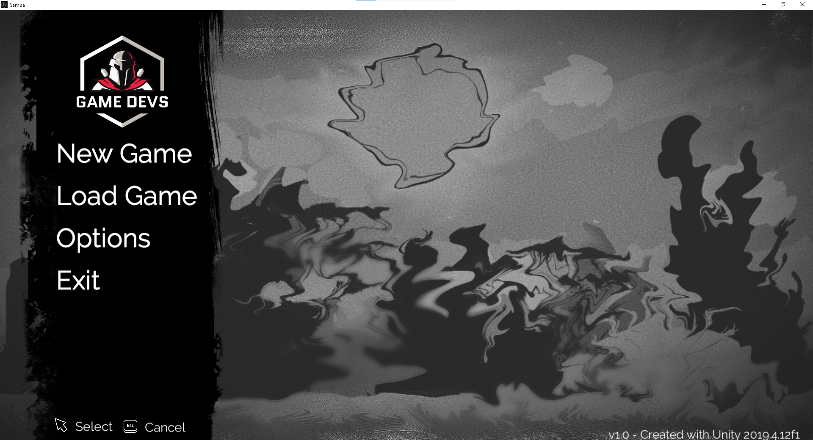
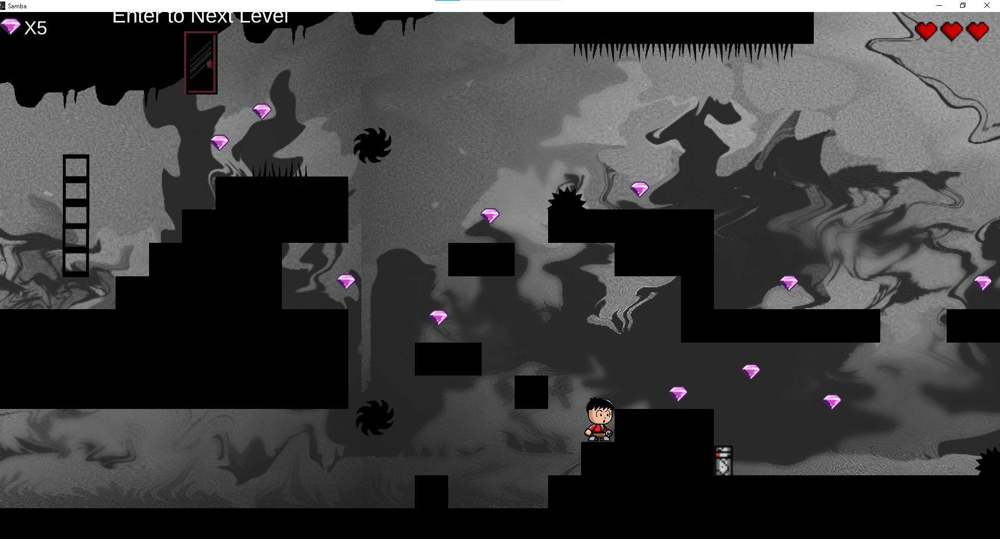

# Samba-v1.0
A 2d game created with Unity

# Unity 2D Game
This game was made during my 3rd Semester Introduction to Game Developement. I created this game using Unity 2d and created my sprites using Piskel https://www.piskelapp.com/. 

------------------------------------------------------------------------------------------------

## Tips
- To Dowload Game

## About The App and Future Updates
- A 2D game 
- Aim is to get as much coin and avoid obstacles and trap along the way
- Get to the endzone to get to the next Level
- MainMenu and Navigation for user to get use to game and set up.

------------------------------------------------------------------------------------------------

## Enemies in the Game
- Spikes
- Moving Spikes horizontally and vertically
- Shooting Turrets
- Turrets work by waking and up and shooting bullets if player is in range.
- if player collides with spikes or bullets , player loses health. 

------------------------------------------------------------------------------------------------

## Motivation
So Far i gained alot of knowledge in OOP and in Introduction to Games i learned alot about Sprites. tilesets , scripting, camera movement, prototyping and some basic Animation.  I was keen to see what i can achieve, so i created a game called Samba using Unity and made my own sprite and tileset using pisket  https://www.piskelapp.com/. 

------------------------------------------------------------------------------------------------

## ScreenShots of Application
 
 
 
